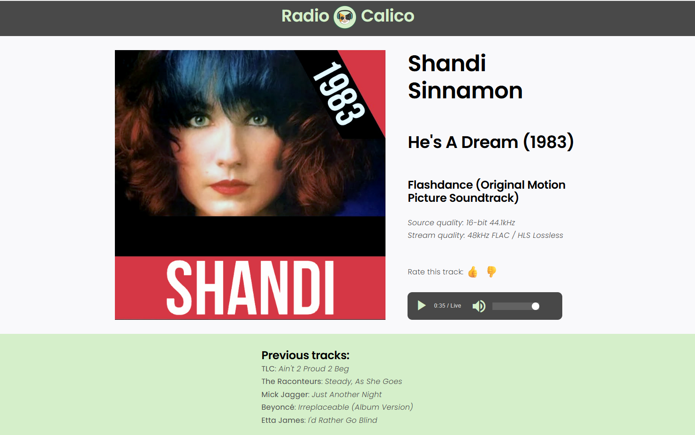

# Radio Calico

[](https://github.com/millerw8/radiocalico)
[](TESTING.md)
[](tests/README.md)

A web-based internet radio streaming application that plays lossless HLS audio streams with real-time metadata display and song rating features.



## Features

- 🎵 **Lossless HLS Audio Streaming** - High-quality audio playback from CloudFront
- 📻 **Real-time Metadata** - Live track information including artist, title, album, and technical details
- 👍👎 **Song Rating System** - Thumbs up/down voting for tracks
- 👤 **User Management** - Create and manage listener accounts
- 🕐 **Recently Played** - Track history of the last 5 songs
- 🎨 **Brand Design** - Clean UI following Radio Calico style guidelines
- ✅ **Comprehensive Testing** - 23 unit tests covering backend API and frontend UI

## Tech Stack

- **Backend**: Node.js, Express 5.x, SQLite (better-sqlite3)
- **Frontend**: Vanilla JavaScript, HLS.js for audio streaming
- **Design**: Custom CSS with Montserrat & Open Sans fonts
- **Testing**: Jest, Supertest, jsdom (23 tests, < 1s execution)

## Quick Start

### Prerequisites

- **Option 1 (Docker)**: Docker and Docker Compose
- **Option 2 (Local)**: Node.js (v14 or higher) and npm

### Installation

#### Using Docker (Recommended)

```bash
# Clone the repository
git clone https://github.com/millerw8/radiocalico.git
cd radiocalico

# Development mode (with hot-reloading)
make dev

# Or production mode
make prod
```

The application will be available at:
- Development: `http://localhost:3000`
- Production: `http://localhost:3000` (or 3001 if using docker compose.yml)

For complete Docker documentation, see [DOCKER.md](DOCKER.md).

#### Local Installation

```bash
# Clone the repository
git clone https://github.com/millerw8/radiocalico.git
cd radiocalico

# Install dependencies
npm install

# Start the server
npm start
```

The application will be available at `http://localhost:3000`

### Development Mode

**Docker**:
```bash
make dev              # Build and start with logs
# Or
docker compose up -d radiocalico-dev
```

**Local**:
```bash
# Start with auto-reload on file changes
npm run dev
```

### Testing

```bash
# Run all tests (23 tests: 12 backend + 11 frontend)
npm test

# Run tests in watch mode (auto-rerun on file changes)
npm run test:watch

# Run with coverage report
npm run test:coverage

# Run only backend tests
npm run test:backend

# Run only frontend tests
npm run test:frontend
```

For detailed testing documentation, see [TESTING.md](TESTING.md).

## Configuration

Create a `.env` file in the root directory:

```env
PORT=3000
DATABASE_PATH=./database/app.db
```

## API Endpoints

### User Management
- `GET /` - API status check
- `GET /users` - List all users
- `POST /users` - Create user (body: `{username, email}`)
- `GET /users/:id` - Get specific user

### Now Playing & Ratings
- `GET /now-playing` - Fetch current track metadata
- `POST /rate-song` - Submit song rating (body: `{title, artist, rating, userId}`)
- `GET /user-rating/:userId/:title/:artist` - Get user's rating for a song

## Project Structure

```
.
├── src/
│   ├── server.js           # Express server with REST API endpoints
│   └── database.js         # SQLite database initialization and schema
├── public/                 # Static files served by Express
│   ├── index.html          # Full-featured player HTML structure
│   ├── styles.css          # All CSS styling (682 lines)
│   ├── app.js              # All JavaScript logic (417 lines)
│   ├── users.html          # User management interface
│   └── logo.png            # Radio Calico logo
├── tests/                  # Test suite (Jest + Supertest + jsdom)
│   ├── backend/
│   │   └── ratings.test.js # Backend API tests (12 tests)
│   ├── frontend/
│   │   ├── setup.js        # Frontend test environment setup
│   │   └── ratings-ui.test.js # Frontend UI tests (11 tests)
│   ├── fixtures/           # Test data and temporary test databases
│   └── README.md           # Detailed testing documentation
├── .github/
│   └── workflows/
│       └── test.yml        # CI/CD test automation
├── database/
│   └── app.db              # SQLite database (auto-created)
├── index.html              # Simple standalone HLS player (root)
├── jest.config.js          # Jest test framework configuration
├── package.json            # Node.js dependencies and scripts
├── .env                    # Environment configuration
├── CLAUDE.md               # Development guidance for Claude Code
├── TESTING.md              # Testing framework overview
├── TEST_SUMMARY.md         # Quick testing summary
├── GETTING_STARTED_WITH_TESTS.md # Testing quick start guide
├── README.md               # This file
└── RadioCalico_Style_Guide.txt  # Brand design system
```

## Database Schema

### users table
- `id` - Primary key
- `username` - Unique username
- `email` - Unique email address
- `created_at` - Timestamp

### song_ratings table
- `id` - Primary key
- `song_title` - Track title
- `song_artist` - Artist name
- `user_id` - User identifier
- `rating` - 1 (thumbs up) or -1 (thumbs down)
- `created_at` - Timestamp
- Unique constraint on (song_title, song_artist, user_id)

## Testing the API

```bash
# Get all users
curl http://localhost:3000/users

# Create a user
curl -X POST http://localhost:3000/users \
  -H "Content-Type: application/json" \
  -d '{"username":"john","email":"john@example.com"}'

# Get now playing
curl http://localhost:3000/now-playing

# Rate a song
curl -X POST http://localhost:3000/rate-song \
  -H "Content-Type: application/json" \
  -d '{"title":"Song Title","artist":"Artist Name","rating":1,"userId":"user123"}'
```

## Stream Configuration

- **HLS Stream**: `https://d3d4yli4hf5bmh.cloudfront.net/hls/live.m3u8`
- **Metadata Endpoint**: `https://d3d4yli4hf5bmh.cloudfront.net/metadatav2.json`

## Code Organization

The application follows a clean separation of concerns:
- **HTML** (`public/index.html`) - Structure and semantic markup only
- **CSS** (`public/styles.css`) - All styling, layout, and visual design
- **JavaScript** (`public/app.js`) - All application logic and interactivity

This modular structure makes the codebase easier to maintain, debug, and extend.

## Design System

Radio Calico follows a custom brand style guide with:

**Colors**:
- Mint (#D8F2D5) - Accents and background fills
- Forest Green (#1F4E23) - Primary buttons and headings
- Teal (#38A29D) - Navigation bar background
- Charcoal (#231F20) - Body text
- Cream (#F5EADA) - Secondary backgrounds

**Typography**:
- Montserrat (headings, bold)
- Open Sans (body text)

For complete styling details, see `RadioCalico_Style_Guide.txt`.

## Testing

Radio Calico includes a comprehensive test suite with 23 unit tests:

- **12 Backend Tests**: API endpoints, database operations, validation, multi-user scenarios
- **11 Frontend Tests**: UI interactions, client-side validation, error handling, state management

### Test Coverage

**Backend Tests** (`tests/backend/ratings.test.js`):
- ✅ POST /rate-song endpoint (create, update, validation)
- ✅ GET /user-rating endpoint (retrieval, null handling)
- ✅ Real SQLite database testing (not mocked)
- ✅ Business logic and edge cases

**Frontend Tests** (`tests/frontend/ratings-ui.test.js`):
- ✅ rateSong function (validation, API calls, error handling)
- ✅ Rating button UI state (active states, disabled states)
- ✅ Mocked fetch, localStorage, and alert
- ✅ Client-side validation and user feedback

### Running Tests

```bash
npm test                  # Run all tests
npm run test:watch        # Watch mode (auto-rerun on changes)
npm run test:coverage     # Generate coverage report
npm run test:backend      # Backend tests only
npm run test:frontend     # Frontend tests only
```

**Test Execution**: All 23 tests run in < 1 second

### CI/CD

Tests run automatically via GitHub Actions:
- On every push to `main` or `develop`
- On every pull request
- Against Node.js 18.x and 20.x

See `.github/workflows/test.yml` for details.

### Documentation

- **[TESTING.md](TESTING.md)** - Comprehensive testing guide
- **[tests/README.md](tests/README.md)** - Detailed documentation with examples
- **[GETTING_STARTED_WITH_TESTS.md](GETTING_STARTED_WITH_TESTS.md)** - Quick start guide
- **[TEST_SUMMARY.md](TEST_SUMMARY.md)** - Quick summary of test coverage

## Contributing

Contributions are welcome! Please feel free to submit a Pull Request.

**Before submitting:**
1. Run `npm test` to ensure all tests pass
2. Add tests for new features
3. Update documentation as needed

## License

ISC

## Author

millerw8
